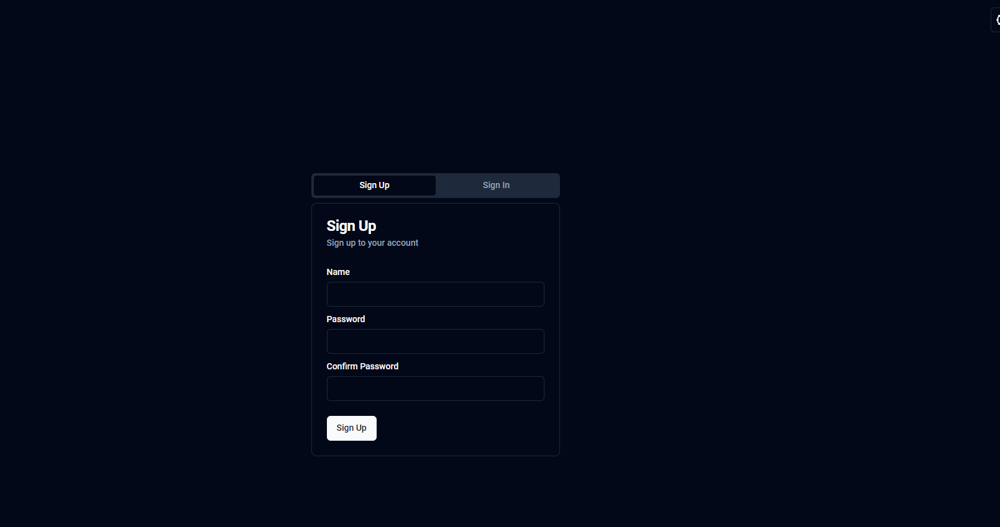
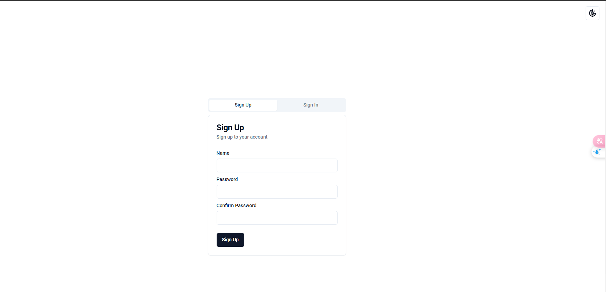
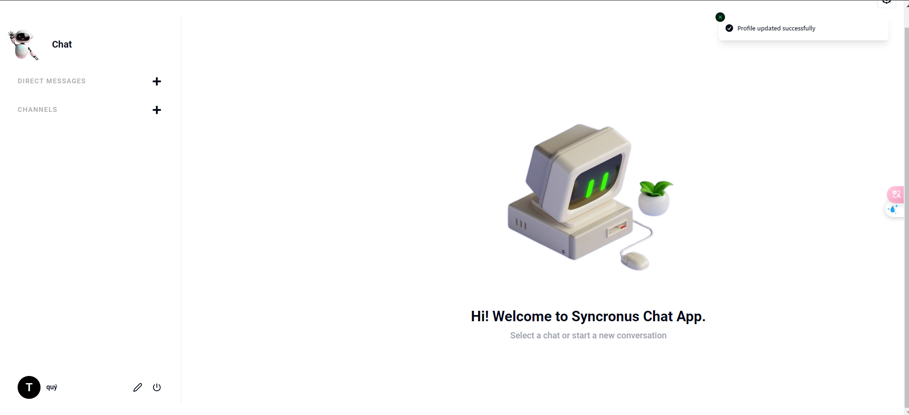
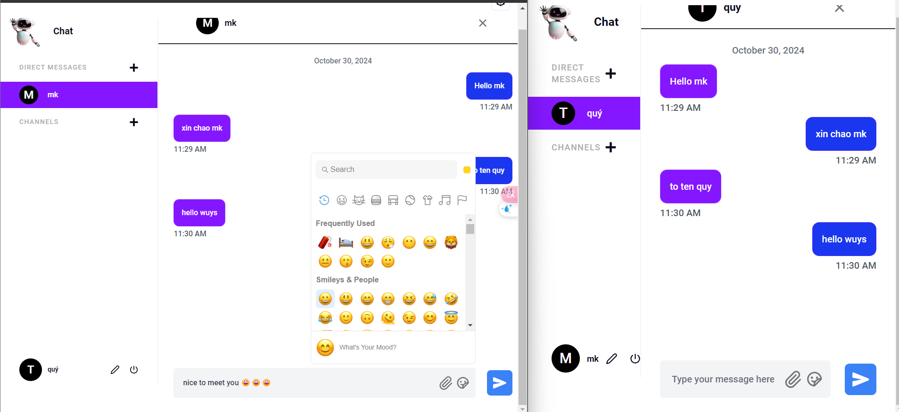
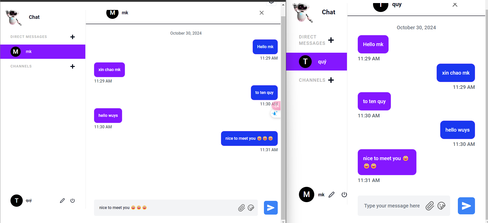
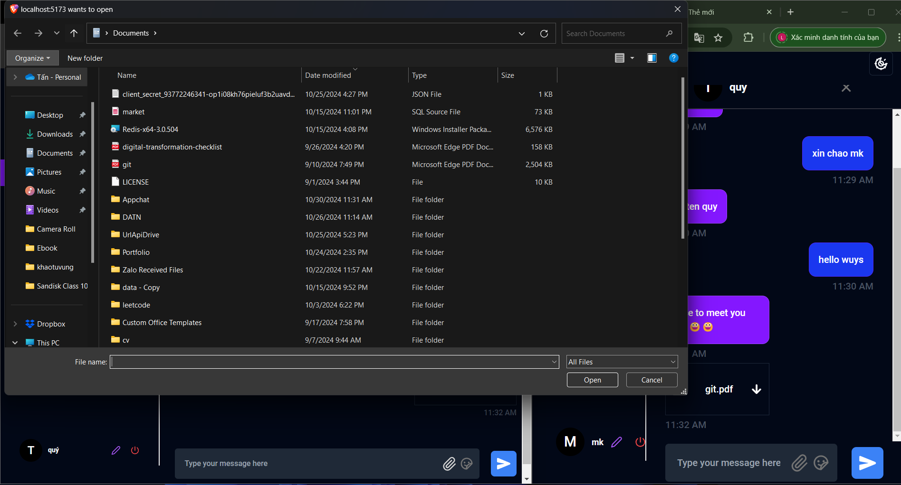
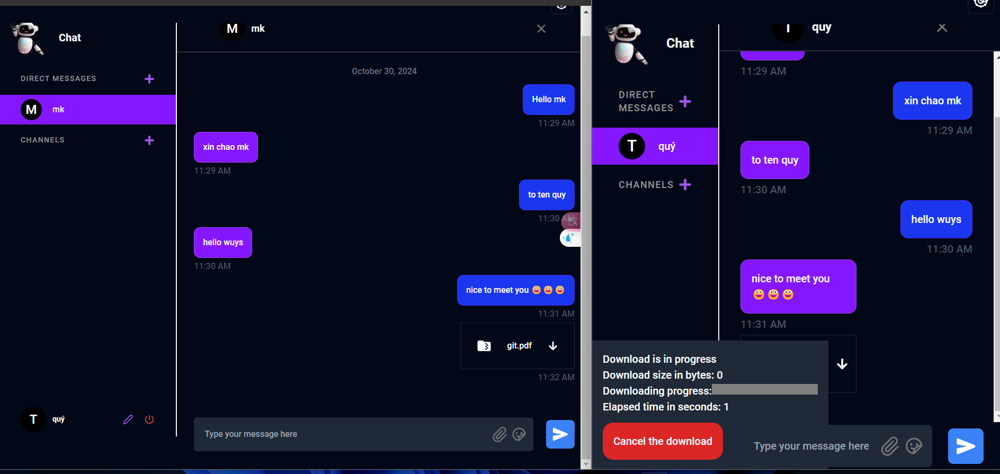
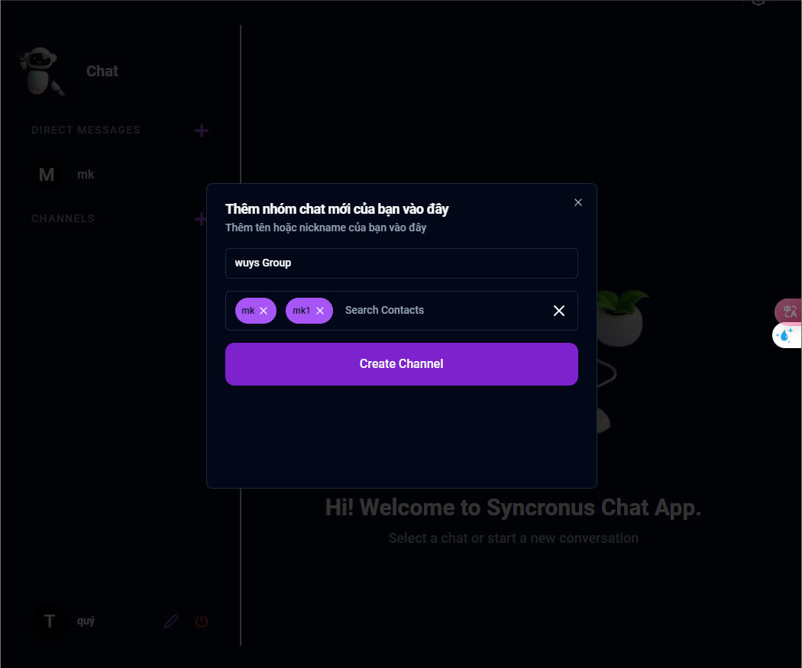
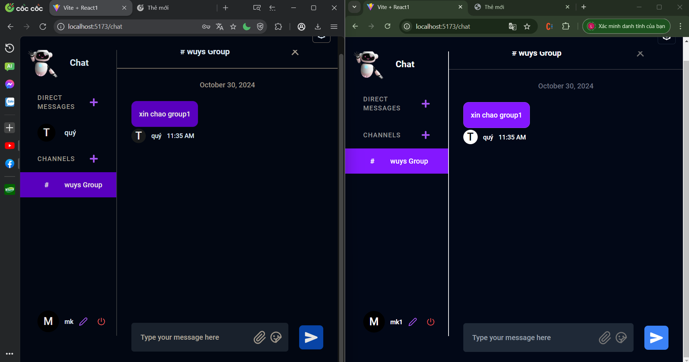

# Title

This is an example file with default selections.

## Install

npm i

## Usage

Fe:npm i - npm run dev
Backend : npm i - npm run dev
Database: Mongo ( Automatic Create )

## File ENV FE:

VITE_SERVER_URL=http://localhost:8800

## File ENV BE:

PORT=8800
JWT_SECRET="()\*&^%$#@!~"
ORIGIN=http://localhost:5173
DATABASE_URL=mongodb://localhost:27017/chat_app

## Auth User

## Update Profile

## Main

=> find person to chat

=> gửi file + down file:

## Tạo group

## License

MIT © Le Văn Quý
